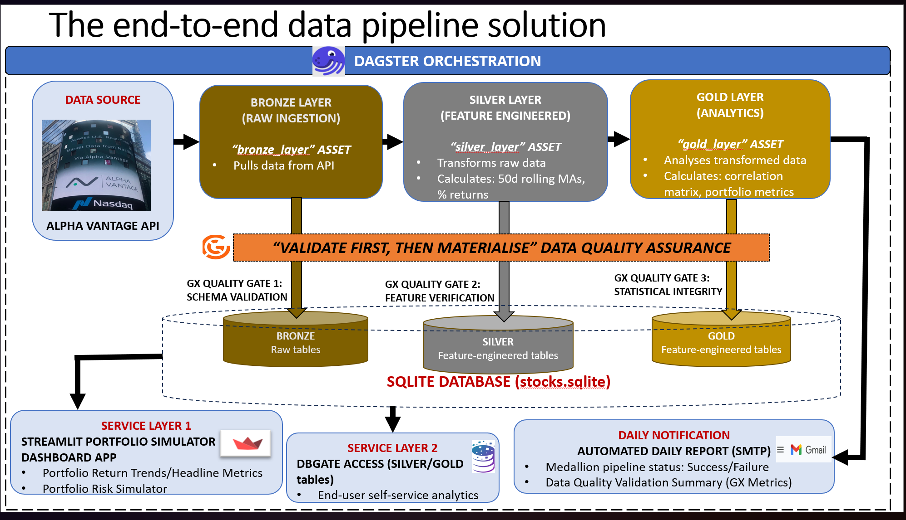
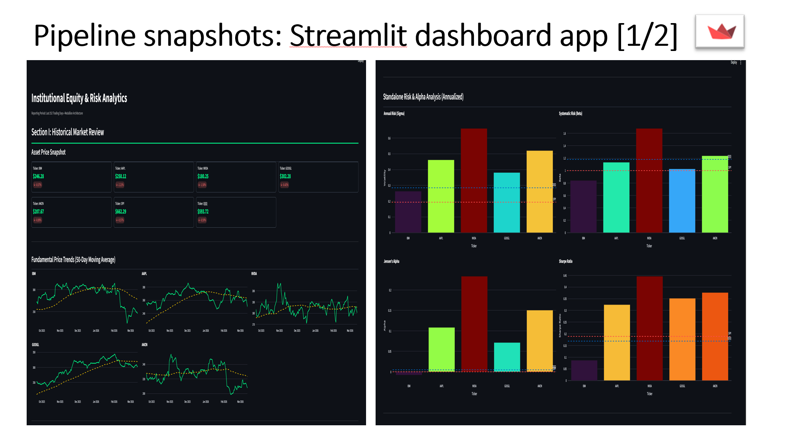
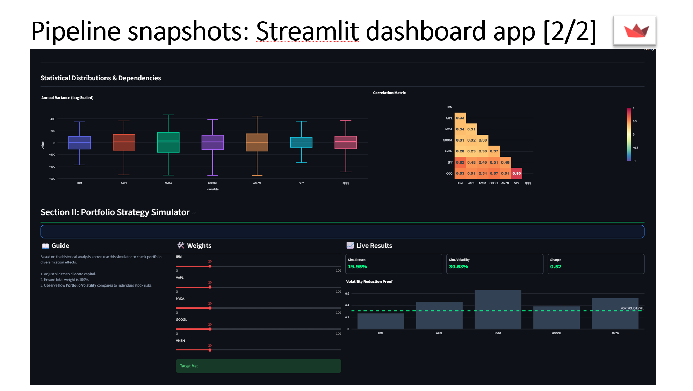
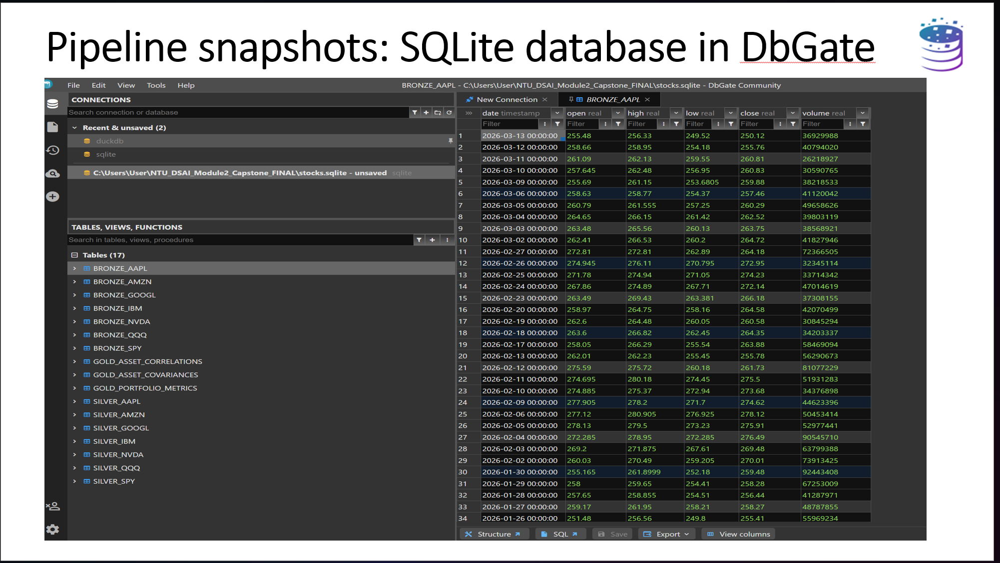

# **Project Overview: US Tech Equity Portfolio Appraisal**

## **Use Case:**

This project addresses a strategic requirement for a Small-to-Medium Enterprise (SME) that has accumulated significant surplus cash reserves.

### ***The Challenge:***

The Board of Directors has identified 5 high-growth US tech stocks — driven by the rapid rise of Artificial Intelligence — for potential inclusion in the company's fiscal reserves. However, given the high volatility of the tech sector, a rigorous risk appraisal is required before capital is committed.

### ***The Objectives:***
As the supporting analyst team, we developed this end-to-end data pipeline to:

#### 1. ***Automate Data Collection:*** Streamline the ingestion of real-time market data from the Alpha Vantage API.

#### 2. ***Quantify Risk:*** Calculate critical financial metrics, including 50-day rolling averages and daily returns.

#### 3. ***Enable Diversification:*** Generate a statistical correlation matrix to support Markowitz risk-return analysis.

#### 4. ***Inform Portfolio Allocation Strategy:*** Provide the CFO with a data-driven portfolio proposal for the upcoming Q3 2026 Board presentation.

# ______________

## **The "Divide-and-Conquer" Approach**

We approach the use case sequentially from two perspectives. 

First, we put on our ***Data Engineer*** Hat to design and operationalise an automated data pipeline solution. 

Next, we wear our ***Data Analyst*** Hat to design the analytical framework and data visualisations to drive the investment decision-making process. 

# ______________

## **Part I: The Data Engineer's Response**

### **Data Pipeline Solution:**

The solution utilises a Medallion Architecture to ensure data is progressively refined and validated before reaching the analytics layer.

### *Pipeline Orchestration (Dagster)*
The entire workflow is orchestrated via Dagster, ensuring a reliable, scheduled, and observable data flow.

### *Medallion Architecture*

#### 1. ***Bronze Layer (Raw Ingestion):*** Pulls raw market data directly from the Alpha Vantage API. This layer focuses on high-fidelity ingestion into a stocks.sqlite database.

#### 2. ***Silver Layer (Feature Engineering):*** Transforms raw data into actionable indicators. This includes calculating 50-day rolling moving averages and daily percentage returns.

#### 3. ***Gold Layer (Analytics):*** Computes high-level portfolio metrics and a correlation matrix. This matrix is a critical statistical indicator for Markowitz risk-return analysis and portfolio diversification.

### *Data Stack*
The project leverages a modern, low-overhead stack designed for reliability and accuracy:

#### 1. ***Data Source:*** Alpha Vantage API (US Real-Time Market Data).
#### 2. ***Orchestration:*** Dagster.
#### 3. ***Storage:*** SQLite (stocks.sqlite).
#### 4. ***Data Quality:*** Great Expectations (GX).
#### 5. ***Analytics App:*** Streamlit (Portfolio Simulator Dashboard).
#### 6. ***Database Management:*** DbGate.

### *Data Quality Assurance (Great Expectations)*
To support high-stakes investment decisions, the pipeline implements a ***"Validate First, Then Materialize"*** strategy using Great Expectations (GX) quality gates at every tier.

### *Quality Gate Rationales*

#### ***Gate 1 (Schema Validation):*** Ensures the "close" price column contains no null values, as missing data would compromise return calculations. It also verifies that "volume" figures are non-negative to flag anomalous API data.

#### ***Gate 2 (Feature Verification):*** Confirms the successful insertion and existence of engineered features (return_pct and rolling_50) required for trend-spotting.

#### ***Gate 3 (Statistical Integrity):*** Validates that all pairwise correlations in the Gold layer remain within the mathematically sound limit of (-1, 1). This ensures the integrity of the risk-reduction analysis presented to the Board.

### **Automated Reporting & Monitoring**
The system includes an automated SMTP notification service. Following each daily refresh, the pipeline sends a summary report detailing:

#### 1. *Overall Pipeline Status:* Success/Failure
#### 2. *GX Validation Summary:*  Number of expectations evaluated and success percentage.
#### 3. *Gold Layer record counts:* For final verification.

# ______________

## **Part II: The Data Analyst's Response**

### **Strategic Endpoints:**
Leveraging on the automated Medallion data pipeline and SQLite storage, we establish two strategic endpoints as service layers to deliver the final ***data product*** for the CFO and Finance team:

#### ***1. Executive Streamlit Dashboard/Portfolio Strategy Simulator for Presentation***

* Bifurcated into two key parts, the Streamlit dashboard begins with a ***Historical Market Review*** section, which aims to give Board members a quick high-level sense of where the tech stocks are heading vis-a-vis the market benchmarks (proxied by the SPY ETF which tracks the broader S&P 500 index and tech-centric QQQ ETF which tracks the NASDAQ-100 index), fundamental 50-day moving average price trends, stock risk metrics (annualized volatility, beta, alpha and Sharpe ratio) as well as a correlation matrix heatmap. The latter is a critical indicator of portfolio risk-reducing diversification effects.

* The dashboard concludes with an interactive ***Portfolio Strategy Simulator***, which factors the stock return correlation structure to generate expected portfolio volatility/risk alongside the weighted portfolio return of any simulated portfolio allocation strategy. By adjusting the asset weights sliders by the side, this tool allows the CFO to perform ***"on-the-fly" simulations*** to address Board members' queries during the Board proposal presentation.

#### ***2. DbGate Query Engine for Quick Ad Hoc SQL Analytics***

* Complementing the ***front-facing*** Streamlit dashboard is a backend DbGate-powered SQL query engine to enable expeditious ad hoc analytics. This is to support the Finance team's analytical and reporting mandates, as they monitor the stock volatilities vis-a-vis broader market fluctuations.

### **Key Insights/Portfolio Risk Implications:**

#### ***1. Total Risks: Annualized Stock Volatilities***

* Except for ***IBM***, ***all*** the remaining 4 tech stocks are way ***more volatile*** than the SPY and QQQ market benchmarks. 

* ***NVIDIA*** has the ***highest annualized volatility/sigma*** while ***IBM*** appears to be the ***least risky***. This comes as little surprise, given that NVIDIA is very much a trail-blazer in the current AI space. IBM, in contrast, is a "traditional" tech counter with much less market hype.

#### ***2. Systematic Risks: Stock Betas (CAPM)***

* Relative to SPY's unit beta, ***all except IBM*** have ***above-one*** betas, reflecting ***higher volatility/fluctuations*** relative to the overall market.

* ***NVIDIA*** has the ***highest beta*** whereas ***IBM*** has the ***lowest beta*** vis-a-vis the broader market.

* This is typical of tech stocks, whose fluctuations tend to be much more amplified than the more "traditional" counters. IBM's sub-one beta reinforces the earlier observation that it is a "conservative" play in the tech space.

#### ***3. Jensen's "Abnormal Returns"/Alphas***

* Relative to CAPM expected returns, ***all except IBM*** stocks evidence ***positive "abnormal returns"*** or Jensen's alphas. This is no surprise at all. In the wider market, tech equities have been outperforming the market, on the back of the rising AI boom. IBM's near-zero but still positive "abnormal returns" means it is still performing in line with expectations albeit much less impressively than the rest.

#### ***4. Sharpe's Risk-Adjusted Excess Returns***

* ***All*** the stocks display sub-one Sharpe ratios, suggesting that the stocks don't deliver strong excess returns vis-a-vis the risk-free rate per unit of total volatility/sigma, on a standalone basis. This is well-aligned with a priori expectations for tech counters - their magnified volatilities/sigmas offset any excess returns above the risk-free rate.

#### ***5. Correlation Matrix***

* The pairwise correlation coefficients amongst the 5 tech stocks vary in the (+0.20, +0.40) range, suggesting a ***moderate tendency to move together in the same direction but in a loosely coupled manner***. 

* ***The implication:*** Investment risks can be potentially reduced or diversified away by building a well-balanced portfolio comprising the 5 tech stocks. This answers the CFO's concerns with managing market risks from investing in highly volatile tech stocks.*** 

#### ***6. The Portfolio Strategy Simulator: Diversification in Action***

* The final piece of the dashboard wraps up the investment narrative nicely. It provides ***persuasive real-time evidence of the benefits of investing in the 5 tech stocks in a well-balanced portfolio***.

* By simulating various asset weights permutations, the Simulator interactively generates the ***weighted portfolio return and volatility, factoring the daily-refreshed pairwise correlation structure and realized stock returns.***

* ***Regardless of the asset weights, the simulated outcomes consistently prove that the portfolio volatility tends to be much lower than those of the individual counters (except for IBM which is relatively low-risk on a standalone basis).***

### **Key Takeaways:** 

#### 1. The tech stocks are high-performing stocks with promising growth upside potential.

#### 2. Common systematic influences aside, the underlying correlation structure - positive but only moderately strong - suggests presence of favourable risk-reducing portfolio diversification effects.

#### 3. A risk-aware portfolio allocation strategy of investing in the stocks within a well-balanced portfolio keeps idiosyncratic stock volatilities in check as more robust risk-adjusted investment returns are pursued.

# ______________

## **Stakeholder Handover**

The hard work from engineering an automated reproducible data pipeline with a modern data stack to exploratory data analysis from ***Ground Zero*** is finally completed. It's time to hand over the data product to the CFO and Finance team for their follow-up with the Board in Q3 2026.

Armed with the tools we have painstakingly designed and operationalised, it's then up to the CFO and Finance Team to leverage them to convince the Board on the most optimal investment strategy to grow fiscal reserves, going forward.